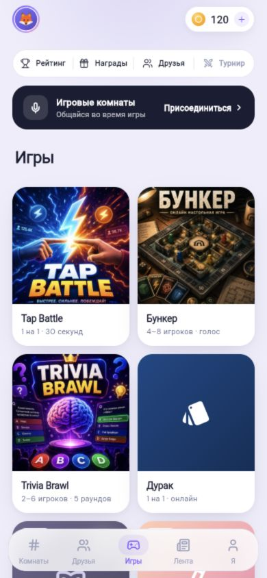

# Play Bro

> A social gaming platform where finding a game is as easy as opening a chat.

**Play Bro** brings lightweight multiplayer games, live rooms, friends and a
shared player profile into one mobile experience. It is being built as a
Kazakhstan-born product for people who want to spend time together online,
without learning a complex game first.

## Посмотреть вживую

[Открыть интерактивное превью Play Bro](https://shutovBro.github.io/play-bro-showcase/) — рабочая браузерная витрина с игровым каталогом, профилем и короткой Tap Battle-сессией. Это автономная презентационная версия: она не подключается к production backend.

Доступ к настоящей мобильной beta-сборке выдаётся через TestFlight по приглашению.

## The idea

Most casual multiplayer games make people choose between a game, a group chat
and a voice room. Play Bro keeps that loop in one place:

`join a room -> find friends -> play -> get a result -> play again`

The product is designed for short, social sessions. Players can enter a room,
invite a friend, play a quick game, earn progression and keep the interaction
going through a feed and profile.

## Current product

| Area | What is available |
| --- | --- |
| Games | Tap Battle, Trivia Brawl, online Durak and Bunker |
| Social | public/private rooms, friends, invitations, feed and comments |
| Progression | XP, coins, cosmetics, achievements and match history |
| Identity | profile, avatar, nickname and privacy controls |
| Safety | server-side profanity filter, reports, blocks and account deletion flow |

The project is in a beta prototype stage. Multiplayer logic is authoritative on
the server and the current build has automated Flutter, HTTP and realtime
scenario checks. Production infrastructure and device validation remain the
next operational milestones.

## Why it matters

Play Bro is aimed at a familiar problem in the region: people want a simple way
to meet, talk and play online, but existing products are either too focused on
one game or require switching between several apps. The platform model lets us
add new social game formats while keeping one identity, friends graph and
progression system.

## Technology

- Flutter for iOS and Android
- Nakama authoritative multiplayer runtime with TypeScript
- PostgreSQL for product data
- LiveKit for voice-room infrastructure
- Firebase Cloud Messaging and Sentry for product operations

## Presentation materials

- [Digital Bridge presentation PDF](Play_Bro_Digital_Bridge.pdf)
- [Interactive preview](https://shutovBro.github.io/play-bro-showcase/)
- [Games catalog](assets/games-catalog.jpg)
- [Player profile](assets/profile.jpg)
- [Cosmetic shop](assets/shop.jpg)

## Repository scope

This repository is a public product showcase. It intentionally does not contain
the application source code, deployment configuration, credentials or user
data.

## Contact

**Olzhas Azirali**  
Play Bro, Kazakhstan  
GitHub: [@shutovBro](https://github.com/shutovBro)
