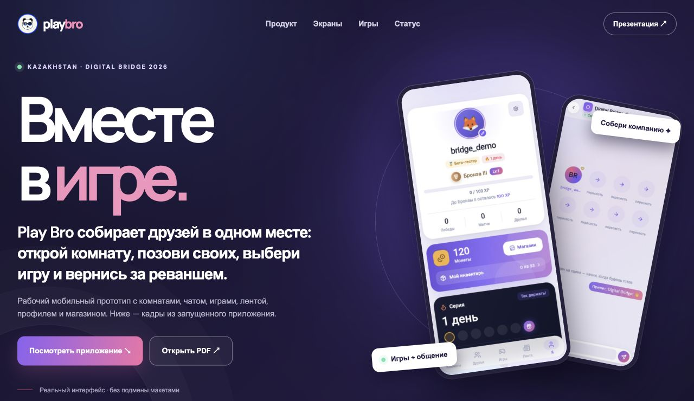
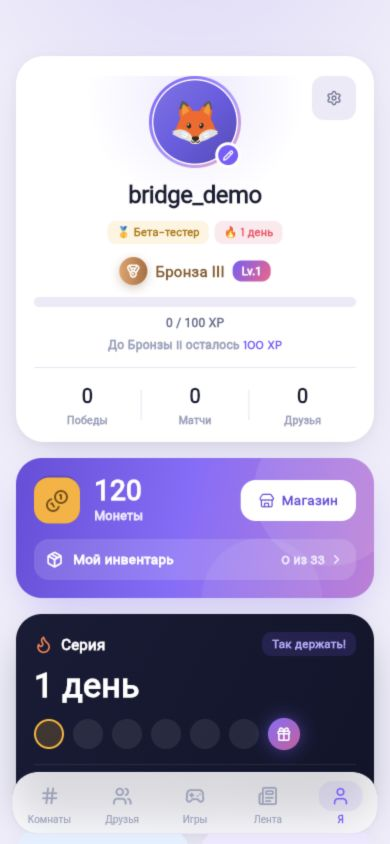
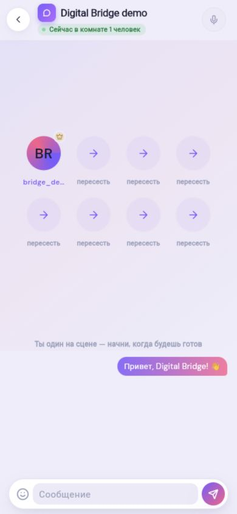
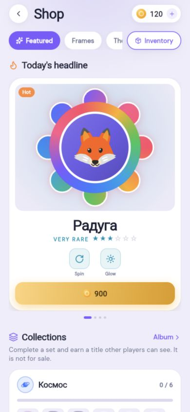
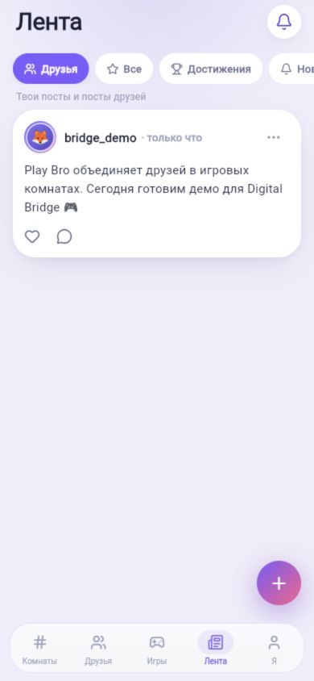

# Play Bro — вместе в игре

**Комнаты, друзья и совместные игры в одном мобильном приложении.** Play Bro — продукт из Казахстана, который превращает «надо бы собраться» в короткий понятный путь: открыть комнату → позвать друзей → сыграть → вернуться за реваншем.

### [Открыть интерактивную витрину →](https://shutovbro.github.io/play-bro-showcase/)

[Смотреть презентацию для Digital Bridge 2026 (PDF)](Play_Bro_Digital_Bridge.pdf) · [Посмотреть реальные экраны](https://shutovbro.github.io/play-bro-showcase/#screens) · [Узнать статус продукта](https://shutovbro.github.io/play-bro-showcase/#status)

> **Статус:** рабочий мобильный прототип, доступный для локальной демонстрации. Публичный сервер и раздача beta-сборки внешним тестировщикам ещё готовятся. Эта витрина позволяет оценить интерфейс и сценарии без учётной записи.

## Что увидит игрок

| Шаг | В приложении |
| --- | --- |
| **Собраться** | Комнаты, места участников, приглашения и чат |
| **Сыграть** | Trivia Brawl, сетевой Дурак и Бункер |
| **Остаться на связи** | Друзья, лента и профиль |
| **Вернуться** | XP, монеты, достижения, история и косметические коллекции |

<table>
  <tr>
    <td align="center"> <b>Профиль</b></td>
    <td align="center"> <b>Комната и чат</b></td>
    <td align="center"> <b>Магазин</b></td>
    <td align="center"> <b>Лента</b></td>
  </tr>
</table>

Кадры сняты с запущенного Play Bro в локальном тестовом окружении. [В галерее на сайте](https://shutovbro.github.io/play-bro-showcase/#screens) их можно увеличить; там же есть создание комнаты, настройки и лобби игр.

## Игры

| Режим | Статус | Реальный экран |
| --- | --- | --- |
| **Trivia Brawl** | В мобильном каталоге, 2–6 игроков, 5 раундов | [Лобби](docs/assets/trivia-lobby.png) |
| **Дурак** | В мобильном каталоге, сетевой стол 1 на 1 | [Стол в ожидании соперника](docs/assets/durak-lobby.png) |
| **Бункер** | В мобильном каталоге, сценарий для 4–8 игроков | [Лобби](docs/assets/bunker-lobby.png) |
| **Белка** | Отдельная браузерная игра против ботов; ещё не встроена в мобильное приложение | [Настоящая партия](docs/assets/belka-game.png) |

Белка показывает направление развития экосистемы Play Bro. Её онлайн-режим пока не открыт. Доступны также [главное меню](docs/assets/belka-menu.png) и [настройки партии](docs/assets/belka-setup.png). Изображения каталога Trivia и Бункера — обложки; ссылки в таблице ведут к подлинным кадрам интерфейса.

## Текущий этап

Play Bro уже содержит основные разделы и серверные игровые сценарии. После последнего аудита прошли **264 Flutter-теста** и отдельные проверки backend. Для внешней beta остаются работы по доступному извне серверу, проверке голоса и push на устройствах и выдаче сборки по приглашению. Мы не заявляем публичный доступ, пока он не работает.

Проект открыт для пилотных компаний игроков, экспертной обратной связи и партнёрств, которые помогут довести продукт до первых активных сообществ.

**Контакт:** Olzhas Azirali · Kazakhstan · [GitHub @shutovBro](https://github.com/shutovBro)

Этот публичный репозиторий содержит только презентационные материалы. Исходный код приложения, конфигурация инфраструктуры, ключи и пользовательские данные сюда не включены.
